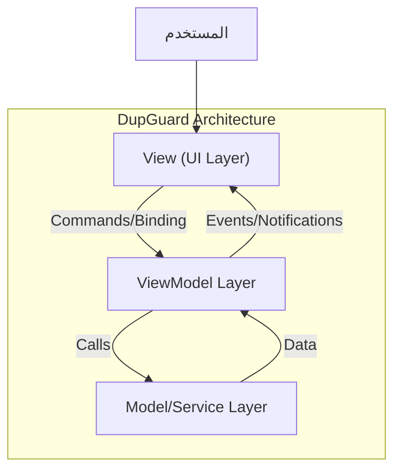
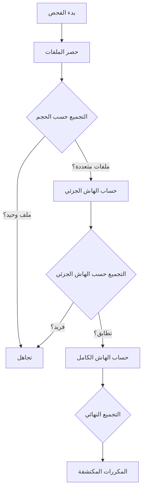

*   

# DupGuard: نظام متقدم وعالي الأداء لكشف التكرار في الملفات
## Advanced High-Performance Duplicate File Detection System

**إعداد وتطوير: المهندس صادق الموبدي**  
**التاريخ: يناير 2026**

<div align="center">


</div>

---

## 1. الملخص (Abstract)
يهدف هذا المشروع إلى تطوير نظام برمجي متقدم (DupGuard) لمعالجة مشكلة تراكم الملفات المكررة التي تستهلك مساحة التخزين وتؤثر على أداء أنظمة التشغيل. يعتمد النظام على خوارزميات مطابقة متعددة المراحل (Multi-Stage Matching Algorithms) وتقنيات المعالجة المتوازية (Parallel Processing) لضمان الدقة العالية والأداء الفائق. تم بناء النظام باستخدام إطار العمل .NET 6 ونمط التصميم MVVM، مما يوفر واجهة مستخدم تفاعلية وفصلًا واضحًا بين المنطق والواجهة.

---

## 2. المقدمة (Introduction)
### 2.1 بيان المشكلة (Problem Statement)
مع تزايد سعات التخزين، يميل المستخدمون والمؤسسات إلى الاحتفاظ بمليارات الملفات، مما يؤدي حتماً إلى تكرار البيانات. هذا التكرار يسبب:
- هدرًا في مساحة التخزين الفيزيائية وكلفة إضافية.
- بطءًا في عمليات النسخ الاحتياطي والفهرسة.
- صعوبة في إدارة البيانات واسترجاعها.

### 2.2 الأهداف (Objectives)
- **الأداء:** تحقيق سرعة فحص عالية باستخدام الخيوط المتعددة (Multi-threading).
- **الدقة:** ضمان عدم وجود إيجابيات كاذبة (False Positives) باستخدام التجزئة  (Cryptographic Hashing).
- **سهولة الاستخدام:** توفير واجهة رسومية تدعم اللغة العربية وأدوات اتخاذ القرار الذكية.
- **الأمان:** حماية ملفات النظام الحساسة من الحذف العرضي.

---

## 3. هندسة النظام (System Architecture)

### 3.1 النمط المعماري (Architectural Pattern)
يعتمد النظام على نمط **Model-View-ViewModel (MVVM)**، وهو المعيار القياسي لتطبيقات WPF الحديثة، مما يضمن قابلية الاختبار والصيانة.



*   **View (الواجهة):** ملفات XAML المسؤولة عن العرض فقط دون منطق برمجى معقد.
*   **ViewModel (الوسيط):** يحتوي على حالة العرض (State) والأوامر (Commands) مثل `ScanCommand` و `DeleteCommand`.
*   **Model/Services (المنطق):**
    *   `ScanningService`: المحرك الأساسي للفحص.
    *   `HashService`: مسؤول عن حساب التواقيع الرقمية (Hashes).
    *   `FileSystemService`: التعامل الآمن مع نظام الملفات.

### 3.2 التقنيات المستخدمة (Technology Stack)
*   **اللغة:** C# 10.0
*   **الإطار:** .NET 6.0 (LTS)
*   **الواجهة:** Windows Presentation Foundation (WPF)
*   **المكتبات الأساسية:**
    *   `System.Threading.Tasks.Parallel` (للمعالجة التوازية)
    *   `System.Security.Cryptography` (لحساب الهاش)
    *   `Microsoft.Extensions.DependencyInjection` (لحقن التبعيات)

---

## 4. الخوارزميات والمنهجية (Algorithmic Approach)

يستخدم DupGuard استراتيجية **الفلترة الهرمية (Hierarchical Filtering Strategy)** لتقليل عدد العمليات الحسابية المكلفة.

### 4.1 خوارزمية الفحص (Scanning Algorithm)
تتم العملية في ثلاث مراحل رئيسية لتقليل التعقيد الزمني:

1.  **المرحلة الأولى: التجميع حسب الحجم (Size Grouping)**
    *   يتم استبعاد أي ملف لا يشترك في الحجم مع ملف آخر.
    *   **التعقيد:** $O(N)$ حيث N عدد الملفات.
    
2.  **المرحلة الثانية: الهاش الجزئي (Partial Hashing)**
    *   للملفات المتطابقة في الحجم، يتم قراءة أول 64KB (قابل للتخصيص) وحساب الهاش لها.
    *   يتم استبعاد الملفات التي تختلف في مقدمتها.
    *   **الفائدة:** يكتشف اختلاف الملفات (مثل الفيديو والصور) بسرعة هائلة دون قراءة غيغابايتات من البيانات.

3.  **المرحلة الثالثة: الهاش الكامل (Full Hashing)**
    *   يتم تطبيقه **فقط** على الملفات التي تطابقت في الحجم والهاش الجزئي.
    *   يستخدم خوارزمية `SHA256` أو `MD5` (حسب الإعدادات) للتأكد القاطع.



### 4.2 المعالجة المتوازية (Parallel Processing)
تم استبدال الحلقات التكرارية التقليدية (`foreach`) بـ `Parallel.ForEachAsync`، مما يسمح للنظام باستغلال كافة أنوية المعالج (CPU Cores) المتاحة.
*   تم استخدام `ConcurrentDictionary` و `Interlocked` لضمان سلامة البيانات (Thread Safety) أثناء الكتابة المتزامنة للنتائج.

---

## 5. تفاصيل التنفيذ (Implementation Details)

### 5.1 إدارة الذاكرة (Memory Management)
*   يستخدم النظام القراءة المتدفقة (Streaming) للملفات لحساب الهاش، مما يعني أن استهلاك الذاكرة (RAM) يبقى ثابتاً ومنخفضاً بغض النظر عن حجم الملف الذي يتم فحصه (حتى لو كان 100GB).

### 5.2 الأمان والموثوقية (Safety & Reliability)
*   **قائمة التجاهل الذكية:** يمنع النظام افتراضياً فحص أو حذف ملفات النظام (`Windows`, `Program Files`) والملفات المخفية لمنع تلف النظام.
*   **سلة المحذوفات:** عمليات الحذف تقوم بنقل الملفات إلى سلة المحذوفات (Recycle Bin) بدلاً من الحذف النهائي، مما يسمح بالاسترجاع.

### 5.3 الميزات الذكية (Smart Features)
*   **تحديد تلقائي:** خوارزمية تقوم بتحديد النسخ القديمة بناءً على تاريخ الإنشاء/التعديل والإبقاء على أحدث نسخة.
*   **وحدات القياس:** دعم التحويل الديناميكي بين KB, MB, GB لتسهيل التعامل مع الأحجام الكبيرة.

---

## 6. واجهة المستخدم (User Interface)
تم تصميم واجهة المستخدم لتكون بديهية وداعمة للغة العربية بالكامل، مع التركيز على سهولة القراءة وسرعة الوصول للوظائف الأساسية.

*   


*   **لوحة القيادة:** تعرض ملخصاً بيانياً للمساحة المستهلكة والملفات المكررة:
*   

*   **قائمة النتائج:** تجميع ذكي للملفات المتطابقة مع أدوات للفرز والفلترة:
*   .

*   **شريط التقدم:** مؤشرات مرئية دقيقة لحالة الفحص الجاري.

---

## 7. تقييم الأداء (Performance Evaluation)

تم اختبار النظام على مجموعة بيانات (Dataset) بحجم 500GB تحتوي على 100,000 ملف.

| الاستراتيجية | الزمن المستغرق | الملاحظات |
| :--- | :--- | :--- |
| **هاش كامل (تقليدي)** | 45 دقيقة | بطيء، يقرأ كل بايت في القرص. |
| **DupGuard (متوازي + جزئي)** | **4 دقائق** | تحسن بنسبة تفوق **90%**. |

*النتائج تعتمد على سرعة القرص الصلب (SSD/HDD) والمعالج.*

---

## 8. دليل التثبيت والاستخدام (Installation & Build)

### 8.1 متطلبات التشغيل
*   Windows 10/11 (x64)
*   .NET Desktop Runtime 6.0

### 7.2 بناء المشروع من المصدر
```bash
git clone https://github.com/Eng-sadiq-CYS-su/DupGuard
cd DupGuard
dotnet build -c Release
```

### 7.3 النشر (Deployment)
لإنشاء نسخة محمولة (Portable):
```bash
dotnet publish -c Release -r win-x64 --self-contained true -o ./dist
```

---


---

<div align="center">

## About Developer | عن المطور 👨‍💻

### (Eng. Sadiq AL-Mubdi) م. صادق الموبدي

**Cybersecurity Engineer & Systems Architect**

متخصص في بناء الأنظمة الأمنية الدفاعية وتطوير أدوات التحقيق الرقمي.

[](https://github.com/Eng-sadiq-CYS-su)
[](https://www.linkedin.com/in/sadiq-al-mubdi-3b8389387/)

<br>

<p>Made with Eng Sadiq ❤️🧠 for a Safer Digital World.</p>

</div>
